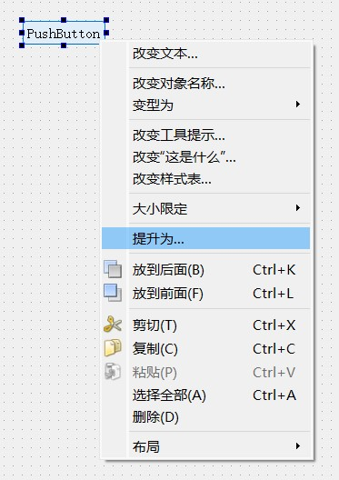
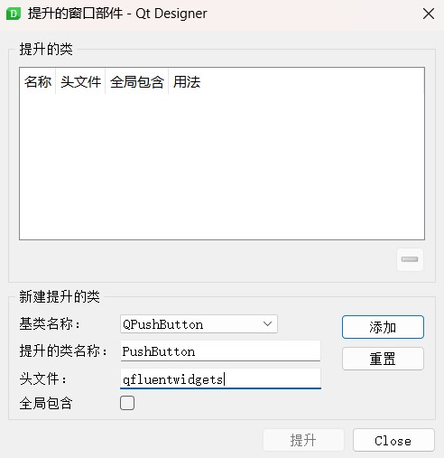
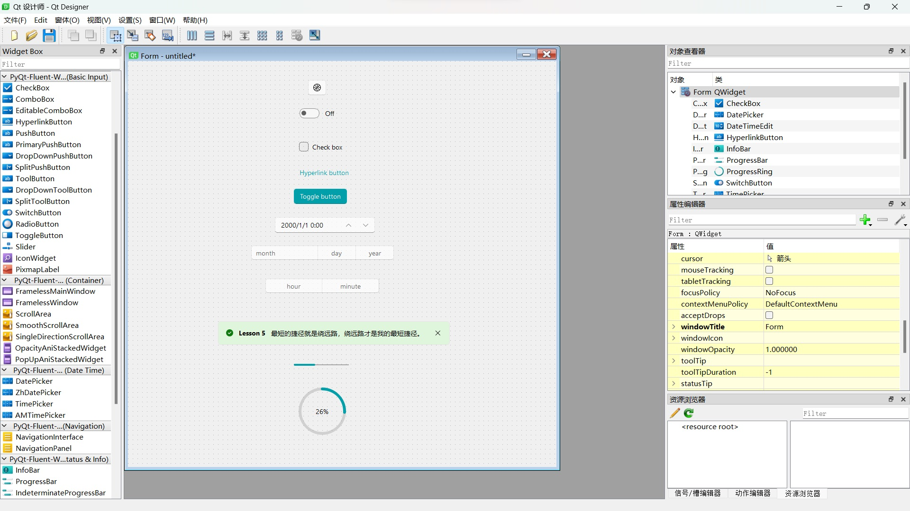

## Designer
In Qt Designer, there are two ways to use PyQt-Fluent-Widgets.

### Promoting widget
Right click on a widget, select the `Promote to ...` of context menu.

Promoting a widget indicates that it should be replaced with the specified subclass, in our case the `qfluentwidgets.PushButton`.



You will be presented with a dialog to specify the custom widget class the placeholder widget will become.

The header file is the name of the Python module used to import the class, which is `qfluentwidgets`. Specify `PushButton` as the class name of the widget to replace it with.



Well, the widget is now promoted to fluent push button. But you won't be able to see any changes within Qt Designer. Save the window as `mainwindow.ui` and compile it to python code, you will see that the `PushButton` is imported from `qfluentwidgets` package.

### Using plugin
1. create a virtual environment, `conda` is the recommended way.
2. Activate virtual environment and run the following code in shell:

   ```sh
   pip install PyQt-Fluent-Widget
   pip install pyqt5-tools
   ```

3. Download the full code from [PyQt-Fluent-Widgets Repo](https://github.com/zhiyiYo/PyQt-Fluent-Widgets).
4. Run `python ./tools/designer.py` to launch Qt Designer (You must use this way to launch Qt Designer).

If everything goes smoothly, you will see all PyQt-Fluent-Widgets components in the sidebar of Qt Designer.
If the startup fails or the components of PyQt-Fluent-Widgets cannot be seen, the solution can be found in [#196](https://github.com/zhiyiYo/PyQt-Fluent-Widgets/issues/196).



The plugin for PySide6 is unstable and may not start QtDesigner successfully. It is recommended to use QtDesigner of PyQt5/6 to generate ui files.

> **Note**
> PyQt5 must upgrade PyQt5-Frameless-Window to 0.2.7 in order to use the plugin, while PySide6 and PyQt6 do not need to upgrading to frameless packages. PySide2 does not support plugins, but you can use PyQt5's QtDesigner to generate ui files and then compile them into py files using uic.